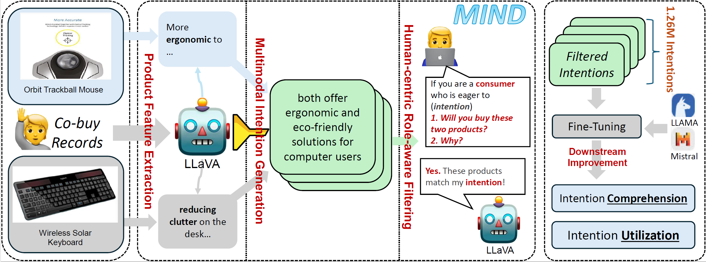

# MIND: Multimodal Shopping Intention Distillation from Large Vision-language Models for E-commerce Purchase Understanding

This is the official code and data repository for the paper **[MIND: Multimodal Shopping Intention Distillation from Large Vision-language Models for E-commerce Purchase Understanding]**



## 1. Framework Pipeline
The Framework consist of three stages

### 1.1 Product Feature Extraction
The file is at: `./llava/serve/feature_extract.py`. The product feature can be extracted by utilizing information from both visual and text modalities

### 1.2 Intention Generation

The intention generation file is at `./llava/serve/intention_generation.py`. Genereate the co-buy intention based on the products' name, images and detailed features. The generation would be constrained by the relation adopted by FolkScope.

### 1.3 Role Aware Filter

The filter file is at `./llava/serve/intention_generation.py`. Use another human-centric LVLM to filter the qualified intentions that aligns well with human.

## 2. Required Packages

Required packages are listed in `requirements.txt`. Install them by running:

```bash
pip install -r requirements.txt
```

## 3. Downstream Evaluation
We use IntentionQA which is a benchmark carefully curated to evaluate LLMs comprehension abilities in E-commerce domain. For further information, please refer to 

## 4. Intention Data Download
Should you want to download the intention data in MIND, please refer to [MIND](https://hkustconnect-my.sharepoint.com/:u:/g/personal/bxuan_connect_ust_hk/EanjwqNcbWxDiw_-hljZ_gsBXBNtoLHZpzGmDnYp31h6ZA?e=TCHhTo)

## 4. Citing this Work
please use the bibtex below for citing our work.
```

```

